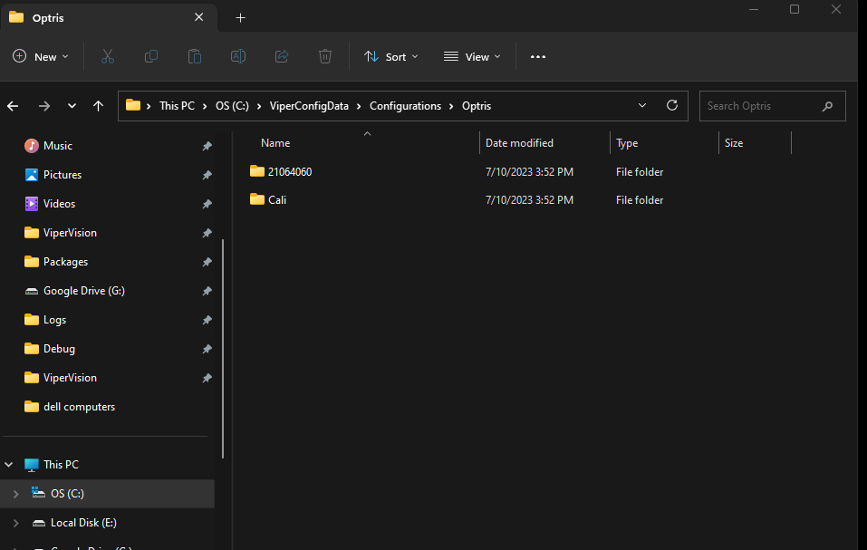
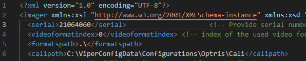
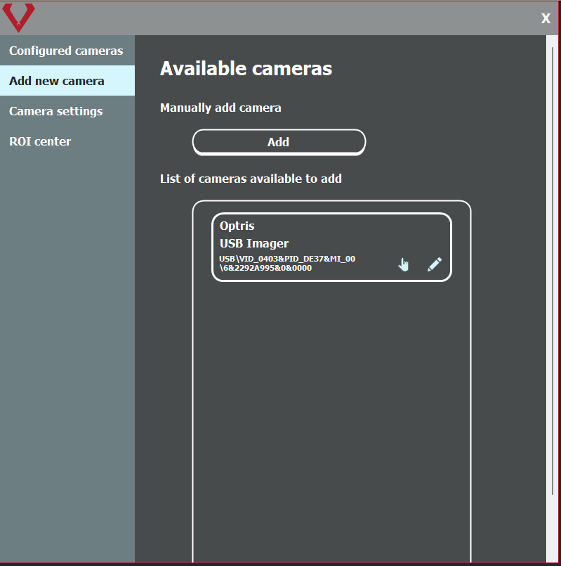
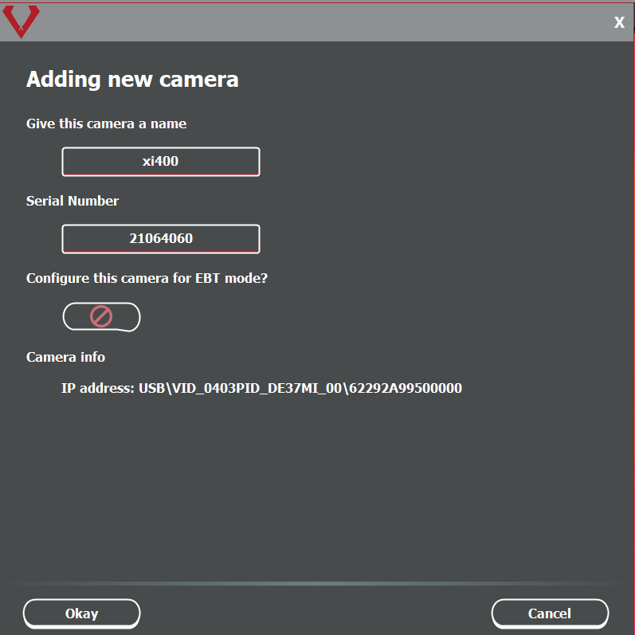
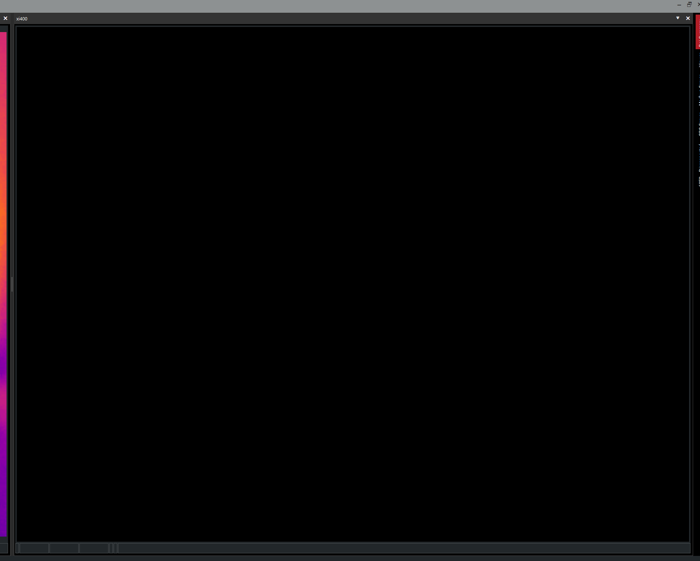
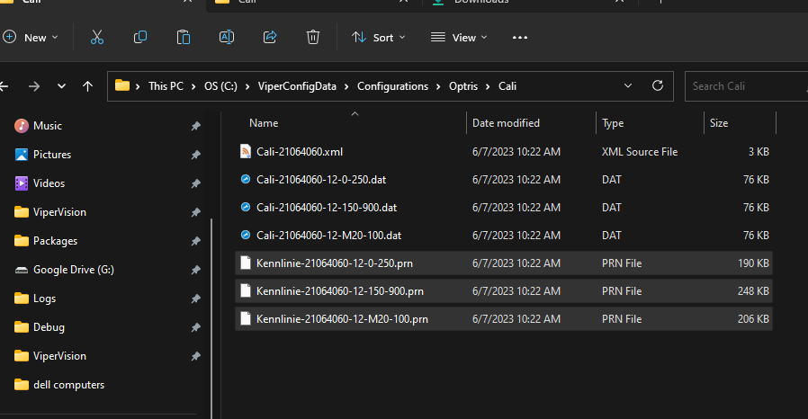
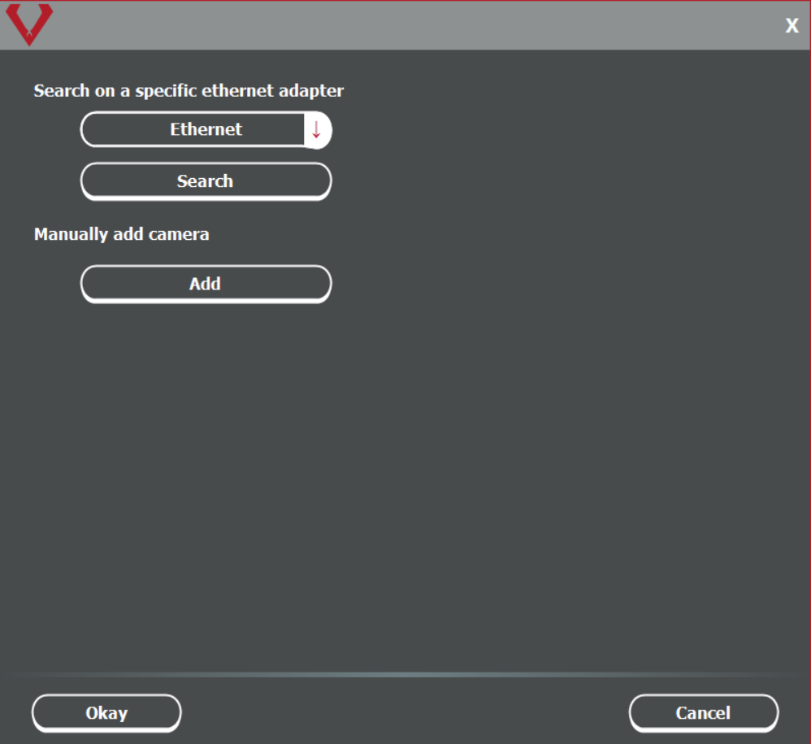

# Optris via ViperVision

- Optris folder structure
- Optris configuration files
- Connecting to Optris camera via USB
- Optris Logs

**Folder structure for Optris Configs and Calibration files**  
```
ViperConfigData
|__Configurations
    |__Optris
        |__21064060 (Camera serial number is where generic.xml file is located)
        |  |__generic.xml
        |
        |__Cali (Calibration files for all cameras go here)
            |__Around seven or so files per camera

```

## **I. Setting Up the Folder Structure for Optris Configs and Calibration Files**

1. Navigate to the `ViperConfigData` directory on your computer.
2. Inside, you should find a sub-directory named `Configurations`.
3. Under `Configurations`, look for the `Optris` folder.
4. Within the `Optris` directory:
   - You should see a folder named after the camera's serial number (e.g., `21064060`). This folder will contain the camera's configuration file, named `generic.xml`.
   - You should also find a folder named `Cali`, which holds the calibration files for all the cameras. Each camera will have around seven or so calibration files.

   

## **II. Managing the Configuration Files**

1. If setting up an Optris camera for the first time, allow the software to auto-generate the necessary folder structure.
2. Navigate to the `ViperConfigData/Configurations/Optris` directory.
3. Ensure that the two key folders (the camera serial number folder and the `Cali` folder) are present.
4. If using a software version older than 4.34.X, you'll need to modify the config file:
   1. Open the `generic.xml` file (found in the camera's serial number directory) using a text editor.
   2. Update the `<serial>` tag to reflect the camera's serial number.
   3. Update the `<calipath>` tag with the calibration files' location, i.e., `C:\ViperConfigData\Optris\Cali`.

   

#### **III. Connecting the Optris Camera via USB**

1. Plug the Optris camera into a USB port.
2. Open the software's camera discovery feature.
3. Check for the listing of "Optris USB Imager" along with vendor ID, manufacturer number, and serial number.

   

4. Select any listed camera to add. You'll be prompted about the calibration files required in the `ViperConfigData/Configurations/Optris/Cali` directory.
5. Name your camera and input its serial number. If the `Optris` configuration directory doesn't exist, the software will create it for you.
6. Add the calibration files (typically seven) to the `Cali` folder. Note: Absent calibration files will result in a black camera image.

   
   
   

7. For software versions older than 4.34.X:
   1. Modify the `generic.xml` file located in the folder named after the camera's serial number.
   2. Update the `<serial>` and `<calipath>` tags as described in section II.
   
8. Restart the software to see the camera image.

#### **IV. Connecting the Optris Camera via Ethernet**
For connecting to Optris camera's via Ethernet we added the Advanced Search menu to help discover the camera's on the network. The Advanced Search menu allows the user to select a ethernet adapter to perform a search on. To open the menu navigate underneath the available camera list and there will be a button for Advanced Search.

As of right now the only way to set the ip address of the optris cameras is through pix connect software.

**Note** As far as we know the PC has to be set to 192.168.0.100 and can't be any other address. This may not be the case but it is what we saw in testing. We could also be doing something incorrectly and will update this document if something changes.



1. Launch the Advanced Search Menu in the software.
2. Choose a specific ethernet adapter to search for Optris devices. Optris cameras connected to that network will appear in the list.
3. To add a camera, provide the camera's serial number and the port it uses to send images. Optris cameras default to port 50101.
4. Name the camera and input the necessary information.
5. The software will attempt to download and place the calibration files. Note: Sometimes the server for calibration files might be unavailable.
6. If everything was successful then you should see the image streaming in the software.

#### **V. Logging Information for Optris Cameras**

1. If you encounter any issues with the Optris camera and the ViperVision logs don't provide insights:
   - Navigate to the log path on your system.
   - Check for a folder named "Optris" to find Optris-specific logs that might help diagnose the camera problems. 

This guide should assist you in setting up your Optris camera through ViperVision. Ensure you have the necessary calibration files and follow the steps carefully. If any issues persist, consult the manufacturer's manual or support team.


