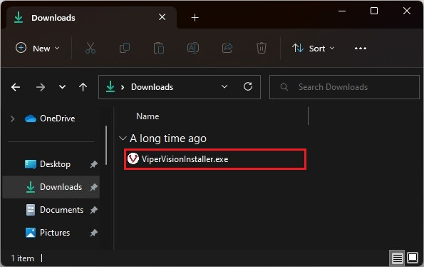
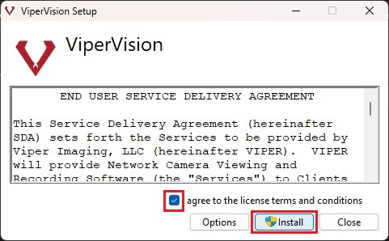
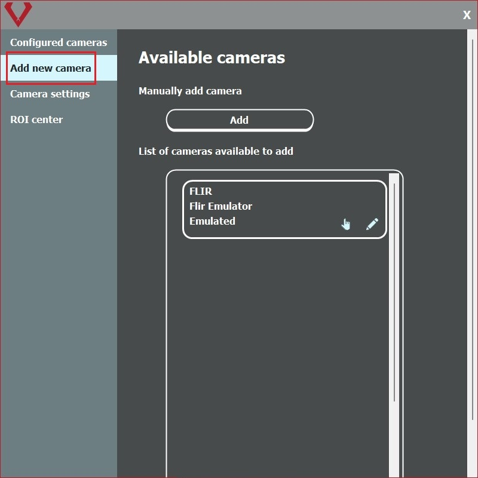
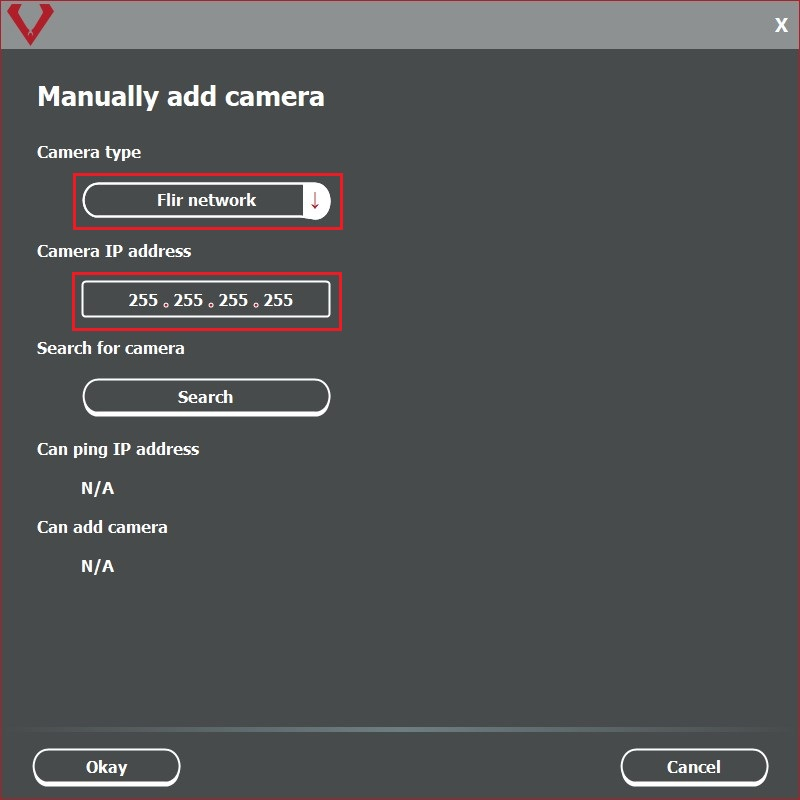

# Viper Vision Quick Start Guide
#### Table of Contents
1. [Installing ViperVision](#installing-vipervision)
2. [Online Registration](#online-registration)
3. [Offline Registration](#offline-registration)
4. [Adding a Camera](#adding-a-camera)

## Installing ViperVision
[Table of Contents](#viper-vision-quick-start-guide)

1. Before installing ViperVision, make sure your Windows system is up to date.

2. Once you have downloaded the installer, start the installation by double clicking the *ViperVisionInstaller.exe* file.

3. Click *Install* after agreeing to the *Terms and Conditions*.  

4. Once the installation is complete you will be notified of a successful install and may now run ViperVision.

## Online Registration
[Table of Contents](#viper-vision-quick-start-guide)

1. Note: online registration requires a network internet connection to properly work.

2. You will be provided a registration key by Viper Imaging. If you do not have this key then you should refer to the [*Offline Registration*](#offline-registration) section located below. Contact Viper Imaging if you have any licensing questions.

3. With ViperVision running navigate to *System Settings*, then the *About* section tab.

4. Select the *Register Online* button.

5. Paste the registration key privided by ViperImaing into the *Enter New Registration Key* field and click *Okay*.

6. Restart the software to update the software version for newly licensed features.

## Offline Registration
[Table of Contents](#viper-vision-quick-start-guide)

1. Log in and navigate to *System Settings*, then the *About* section tab, click the *Register Offline* button.

2. Click *Copy* to place the machine key in the clipboard.

3. Paste the copied machine key into an email and send it to licensing@viperimaging.com to request your license.

4. Viper will create a license that corresponds to your purchase order and send you back the license key.

5. Copy the license key and paste it in the *Enter New License Key* field.  Click Okay and your system will be licensed.

6. Restart the software to update the software version for newly licensed features.

## Adding a Camera
[Table of Contents](#viper-vision-quick-start-guide)

1. From the left sidebar menu click *Cameras*.

2. Click *Add New Camera* from the left sidebar. All available cameras will be displayed in the *List of Cameras Available* section.

3. If your desired camera **is** in the list click the *Pointer Icon*.

4. Name your camera and click *Okay* to return to ViperVision.

5. If your desired camera is **not** in the list and you know the IPv4 Address: under the *Manually Add Camera* section click the *add* button.

6. Select your *Camera Type* and enter its IPv4 address.

7. After the camera is located, click *Okay* to return to ViperVision.

[Back to Top](#viper-vision-quick-start-guide)
