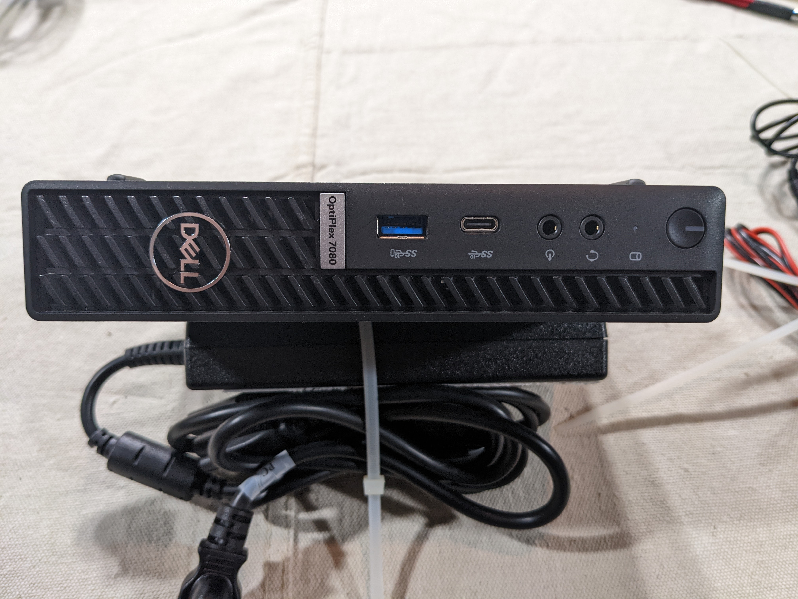
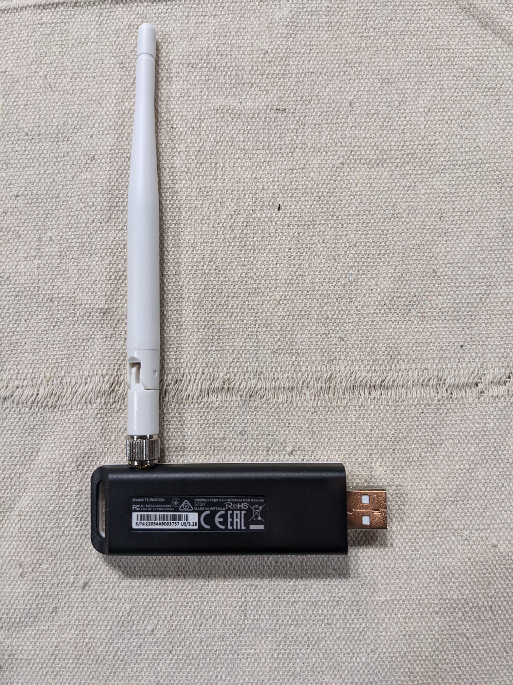

# Viper V1 Parts List
The purpose of this document is to describe V1 parts which may hold consumer value. The following accounts for one (1) unit. Miscellaneous materials and scrap metal have been omitted from this description.

- [Speaker and Amplifier](#speaker-and-amplifier)
- [USB Multi-port Hub](#usb-multi-port-hub)
- [LED Hub and Controller](#led-hub-and-controller)
- [Computer and Monitor](#computer-and-monitor)

## Speaker and Amplifier
- (2) Speakers--YDT59-8SBLH, 8 Ohm, 5 Watt
- Audio Power Amp Gen 2, PartNo: 94V-0

View Pictures

  

## USB Multi-port Hub
- Tripp-Lite, 10 Port USB 2.0 Hub, ModelNo: U223-010

View Pictures

  

## LED Hub and Controller
- Gold Finger LED Controller
- Gold Finger Settings Switch
- LED strip with six (6) lights

View Pictures

## Computer and Monitor
- Dell OptiPlex 7080 Micro, ModelNo: D140
- GoldFinger E504630 23" LCD Touchscreen Monitor, ModelNo: GF-22H2PA11-KIPIXEL
- TP-Link 150 Mbps USB/Wifi Adapter, ModelNo: TL-WN722N

View Pictures

