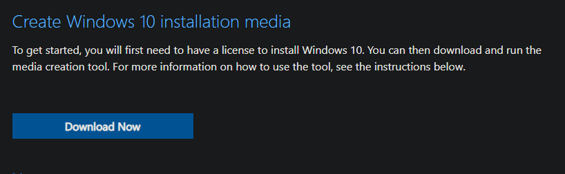
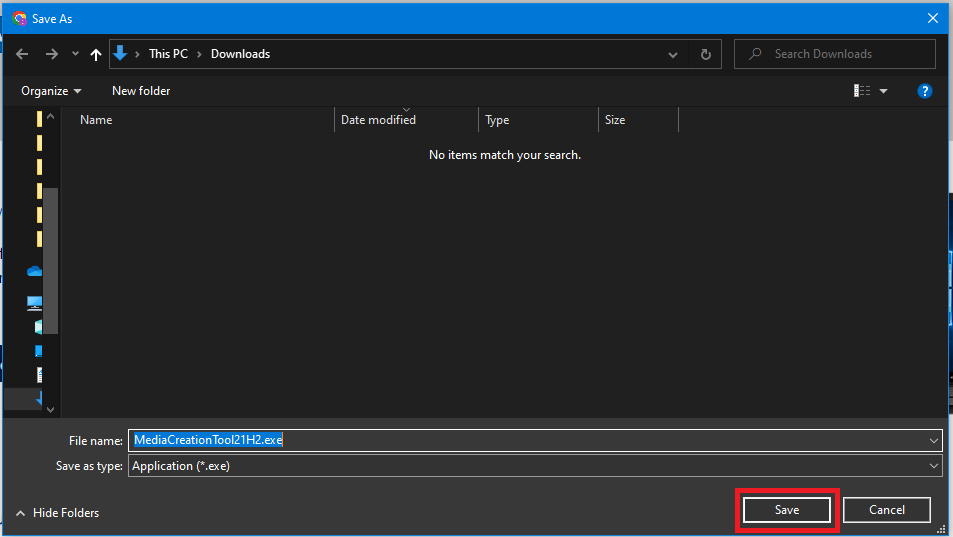
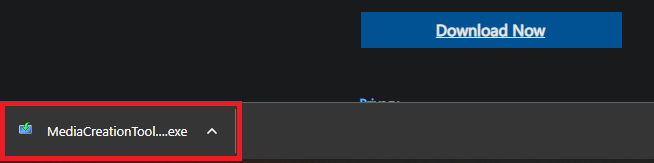
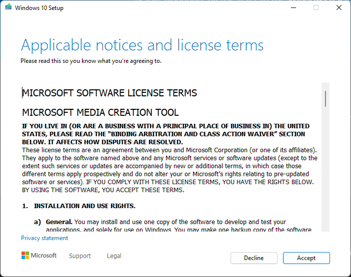
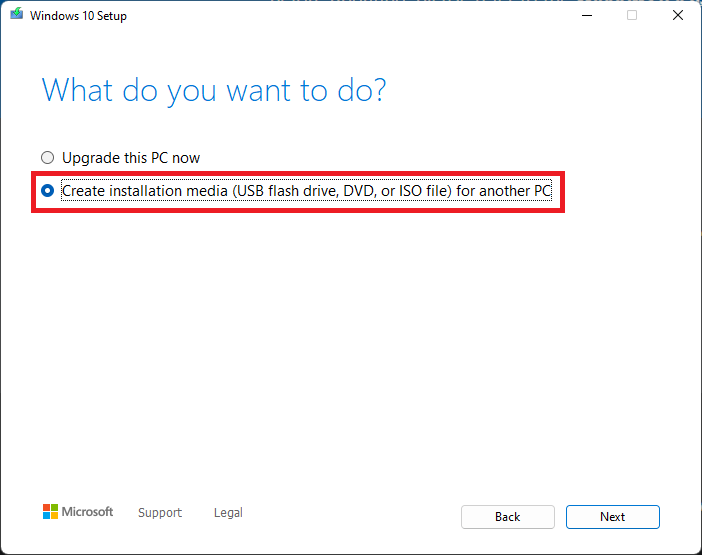
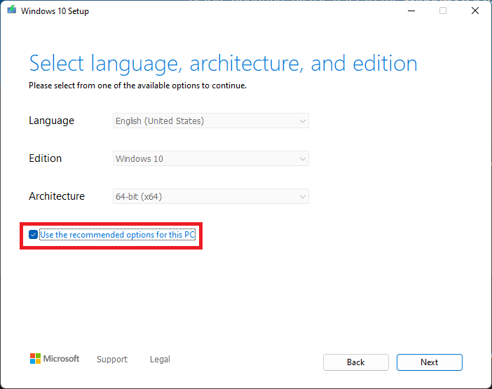
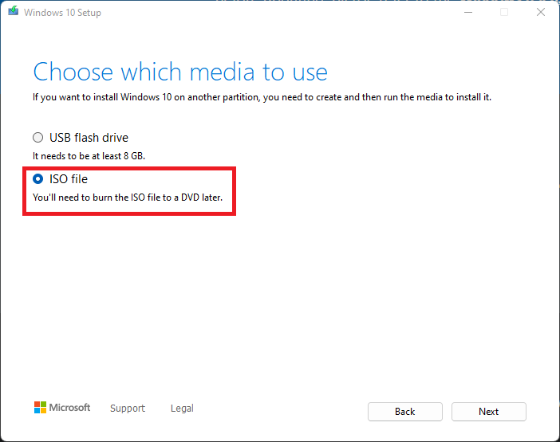
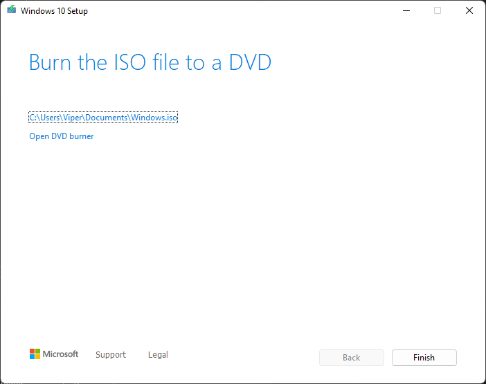

# Preparing Windows 10 for a Virtual Machine
The purpose of this document is to guide the user through the acquisition of the Windows 10 *.iso* file.

## Downloading the installer 

Visit the Windows page [here](https://www.microsoft.com/en-us/software-download/windows10)

Click **download now** as illustrated in the image below  

After clicking download, you may be prompted to select a location to save the creation tool. Select save to continue.  

Once the installer wizard has completed downloading, *it shouldn't take long*, double click the file in your downloads bar at the bottom of your browser.  

Note: If it does not appear here you can access it though the downloads folder.

## Navigating the Windows Installer

Prompt: *Applicable notices and license terms* click **Accept**  

Prompt: *What do you want to do?* Select **Create Installation Media** and click **Next**.  

Prompt: *Select language, architecture, and edition* make sure **Use the recommended options for this PC** box is selected and click **Next**

Prompt *Choose which media to use* select **ISO File** and click **Next**

You will be prompted to save the *.iso* file to a directory, the default option is *C:\Users\YOUR_USER_NAME\Documents\Windows.iso* You may change this location if it suits your needs. After you have selected your directory the install will download the file automatically.

Once the file has completed downloading you may exit the installer by selecting **Finish**

